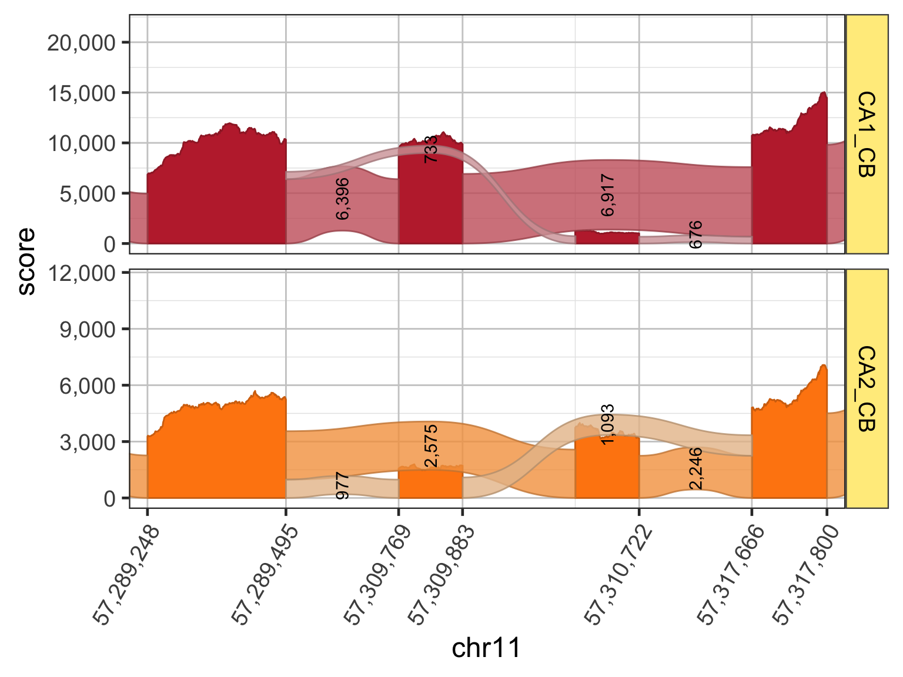

<!-- README.md is generated from README.Rmd. Please edit that file -->
splicejam 
===================================================================================================================================================

Splicejam was created to analyze and visualize RNA-seq and transcript isoform splicing data. Splicejam aims to provide sashimi plots with enough customizations to support publication-quality figures.

An example sashimi plot is shown below for the gene *Gria1*. Each panel shows transcript expression in a region of mouse hippocampus, where "CA1\_CB" shows data that originated from cell bodies of CA1, and "CA2\_CB" shows corresponding data from cell bodies of CA2.

 

<figure>

<figcaption>
A depiction of the CA1 and CA2 regions of mouse hippocampus is shown in Fig 4a from <a href="https://dx.doi.org/10.1038/nrn.2015.22">Dudek et al. Nature Reviews Neuroscience(2016)</a>
</figcaption>
</figure>
 

Features of a splicejam sashimi plot:
-------------------------------------

-   The dark color polygons represent RNA transcript sequence coverage for exons in the Gria1 gene.
-   Wide ribbons are drawn to indicate splice junctions, areas where the sequences are aligned with a wide gap, typically spanning two exons.
-   The thickness of the ribbon (in height) represents the number of aligned reads that span the gap, usually about 70-80% the height of the adjacent exons.
-   The ribbons are shaded light to dark based upon how predominant the splice junction is from exon to exon. The darkest ribbons represent the most predominant path from exon to exon through the gene.
-   Introns are drawn with a fixed width (along the x-axis) and do not use genome coordinates. Introns are normally about 100 times wider than exons, and when drawn to scale obscure the detailed coverage of the exons. The x-axis labels indicate genome coordinates.

Sashimi plot at closer range
----------------------------

The x-axis range is adjusted in the following plot to show more detail around the differentially spliced exons. Notice the relative heights of the exons differ across CA1 and CA2, consistent with the corresponding changes in splice junctions. Clearly CA1 and CA2 favor different and mutually exclusive exons for Gria1.

Incidentally, these two isoforms of Gria1 represent the ["flop" and "flip"](https://www.sciencedirect.com/topics/neuroscience/gria1) forms of the AMPA receptor complex. In human, the genes Gria2, Gria3, and Gria4 comprise the AMPA receptor complex, and each genes has two isoforms with "flop" and "flip" designations.

Package Reference
-----------------

A full online function reference is available via the pkgdown documentation:

Full splicejam command reference: <https://jmw86069.github.io/splicejam>

The splicejam package is part of a suite of R packages called "jampack" which is available through GitHub, see <https://github.com/jmw86069/jampack>

How to install
--------------

Install using the R package `devtools` and this command:

    devtools::install_github("jmw86069/splicejam")

About sashimi plots
-------------------

Sashimi plots were originally envisioned by MISO, which introduced the innovative idea to compress intron width in order to reveal the detailed exon sequence coverage, and to highlight changes in splice junctions.

Katz, Y, Wang ET, Silterra J, Schwartz S, Wong B, Thorvaldsdóttir H, Robinson JT, Mesirov JP, Airoldi EM, Burge, CB. *Sashimi plots: Quantitative visualization of alternative isoform expression from RNA-seq data.* <http://biorxiv.org/content/early/2014/02/11/002576>

Splicejam re-envisions classic sashimi plots by displaying splice junctions as wide arcs proportional in size to the number of junction reads, making them directly comparable to exon coverages on the same plot. Inspired by:

-   [Sankey plots](https://en.wikipedia.org/wiki/Sankey_diagram),
-   [flow diagrams](https://en.wikipedia.org/wiki/Flow_diagram),
-   [Alluvial diagrams](https://en.wikipedia.org/wiki/Alluvial_diagram).

These ribbons were ultimately made feasible to implement in R thanks to the package [ggforce](https://ggforce.data-imaginist.com/) which implemented [geom\_diagonal\_wide](https://ggforce.data-imaginist.com/reference/geom_diagonal_wide.html).
